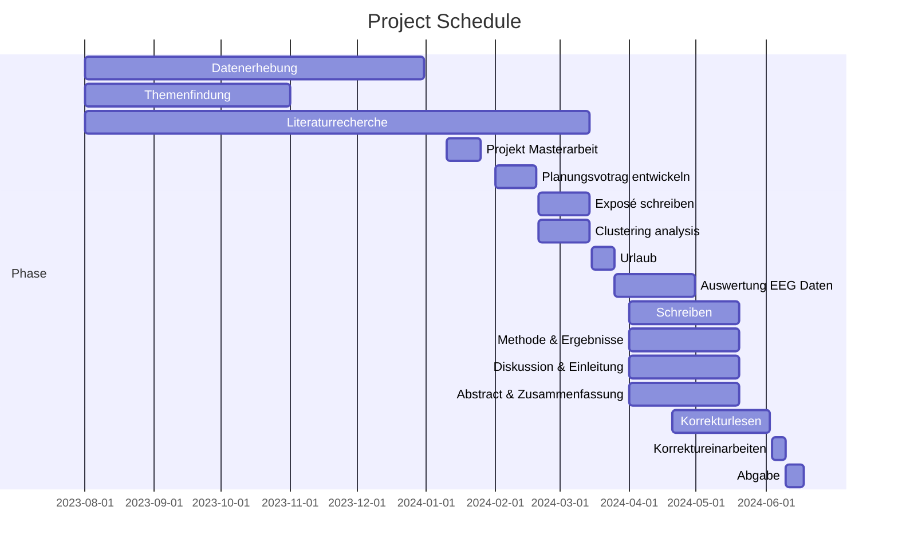

# 👩‍🎓 Janka's Master's Thesis 👩‍🎓
GitHub Repository for my master's thesis

## 📋 protocols
contains all the meeting transcripts

## 📆 timetable

## 📔📝notes
- to-dos
- questions
## 📚 literature
contains all the literature 

## 🖼️ presentations
- Planungsvortrag
