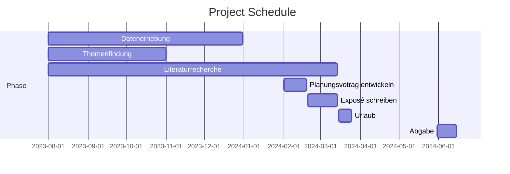

# masterthesis

## :calendar: Timetable

```mermaid
gantt
    title Project Schedule
    dateFormat YYYY-MM-DD

    section Phase
    Datenerhebung              : 2023-08-01, 2023-12-31
    Themenfindung              : 2023-08-01, 2023-11-01
    Literaturrecherche         : 2023-08-01, 2024-03-14
    Planungsvotrag entwickeln  : 2024-02-01, 2024-02-19
    Exposé schreiben           : 2024-02-20, 2024-03-14
    Urlaub                     : 2024-03-15, 2024-03-25
    Abgabe                     : 2024-05-31, 2024-06-15
```
