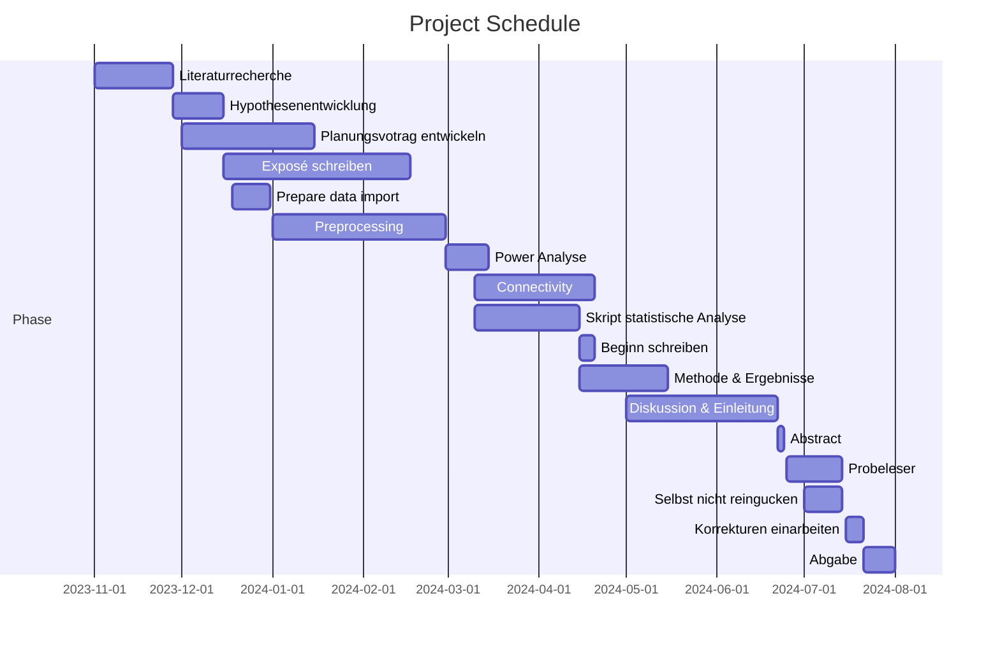

# masterthesis

## :calendar: Timetable

```mermaid
gantt
    title Project Schedule
    dateFormat YYYY-MM-DD

    section Phase
    Literaturrecherche         : 2023-11-01, 2023-11-28
    Hypothesenentwicklung      : 2023-11-28, 2023-12-15
    Planungsvotrag entwickeln : 2023-12-01, 2024-01-15
    Exposé schreiben           :2023-12-15, 2024-02-17
    Prepare data import        : 2023-12-18, 2023-12-31
    Preprocessing              : 2024-01-01, 2024-02-29
    Power Analyse              : 2024-02-29, 2024-03-15
    Connectivity               : 2024-03-10, 2024-04-20
    Skript statistische Analyse : 2024-03-10, 2024-04-15
    Beginn schreiben           : 2024-04-15, 2024-04-20
    Methode & Ergebnisse       : 2024-04-15, 2024-05-15
    Diskussion & Einleitung    : 2024-05-01, 2024-06-22
    Abstract                   : 2024-06-22, 2024-06-24
    Probeleser                 : 2024-06-25, 2024-07-14
    Selbst nicht reingucken    : 2024-07-01, 2024-07-14
    Korrekturen einarbeiten    : 2024-07-15, 2024-07-21
    Abgabe                     : 2024-07-21, 2024-08-01
```
