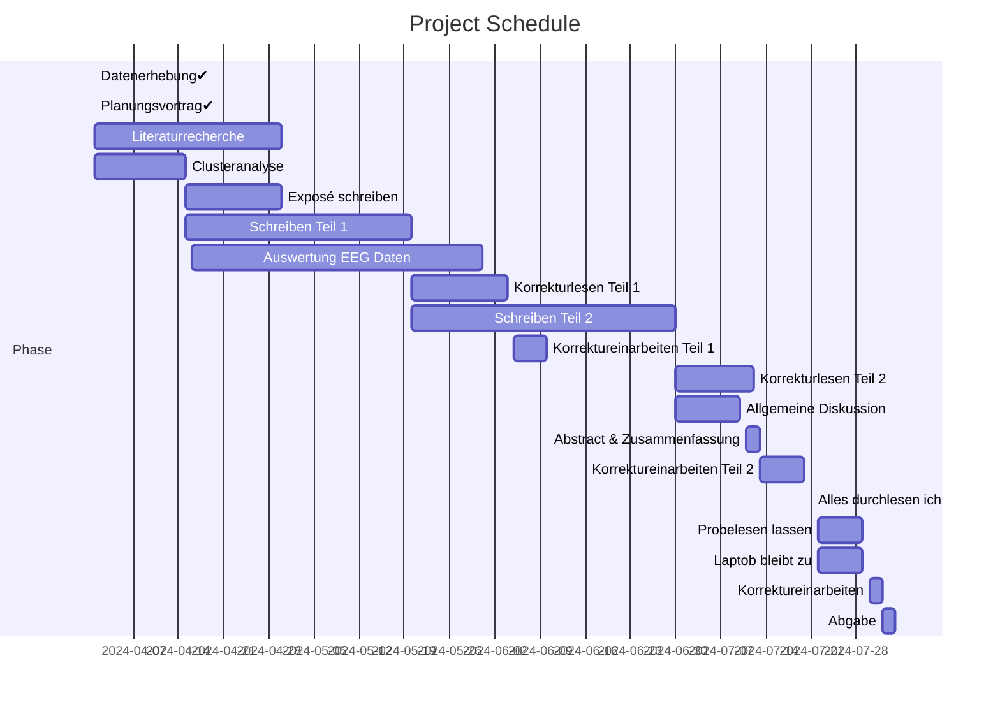

# 👩‍🎓 Janka's Master's Thesis 👩‍🎓
GitHub Repository for my master's thesis

## 📋 protocols
contains all the meeting transcripts

## 📆 timetable

## 📃 scripts
- preprocessing
- preprocessingAge
- preprocessingAgeNback
- Hierarchical_clustering
- K-means

## 💾 data
- raw data
- comments

## 🧩🔍 clustering
- stabilitätsprüfung
- validitätsprüfung
- load
- fehleranalyse
- summary: Everitt et al., 2011
  - overview of data types and applicable clustering methods
- summary: Bacher & Wenzig, 2010
- summary: Backhaus et al.,  2011
  - ablaufschritte und Entscheidungsprobleme der Clusteranalyse
- summary: Wentura & Pospeschill, 2015
  
## 📝 notes
- to-dos
- questions
- sources
- structure
- notes
  
## 📚 literature
contains all the literature 

## 📑documents
- Richtlinien zur Erstellung von Abschlussarbeiten
- Deckblatt Exposé
- Exposé
- Anmeldung Masterarbeit
- Falschzugeordnet

## 🖼️ presentations
- planungsvortrag
- EPOC1804
- clustering

## 📊 plots
- contains all the plots
